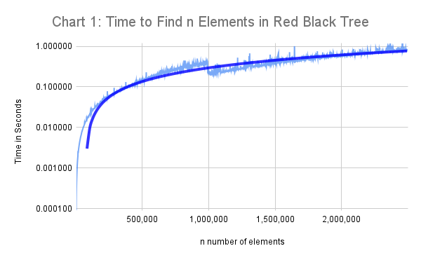
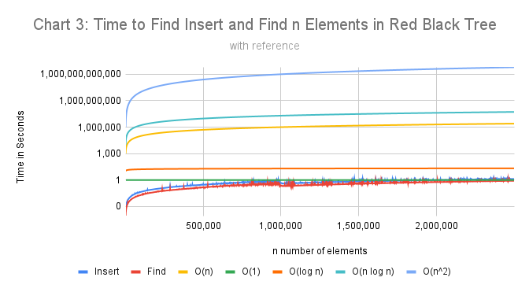
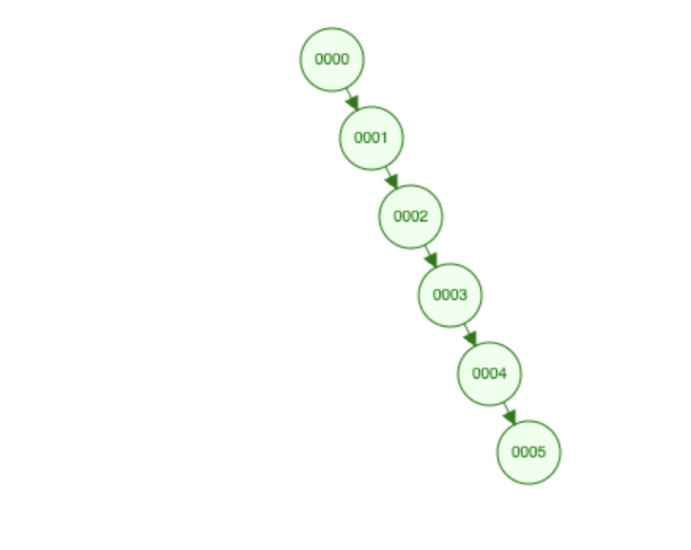
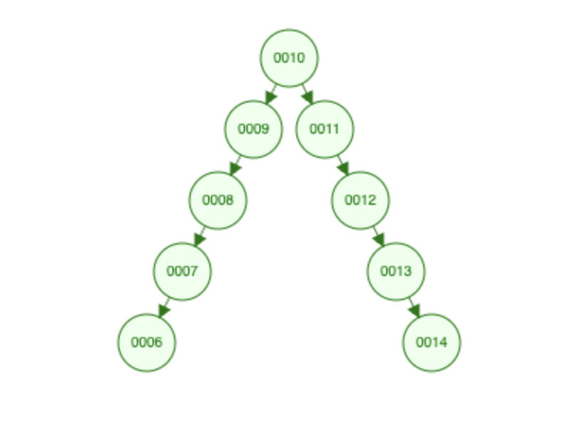
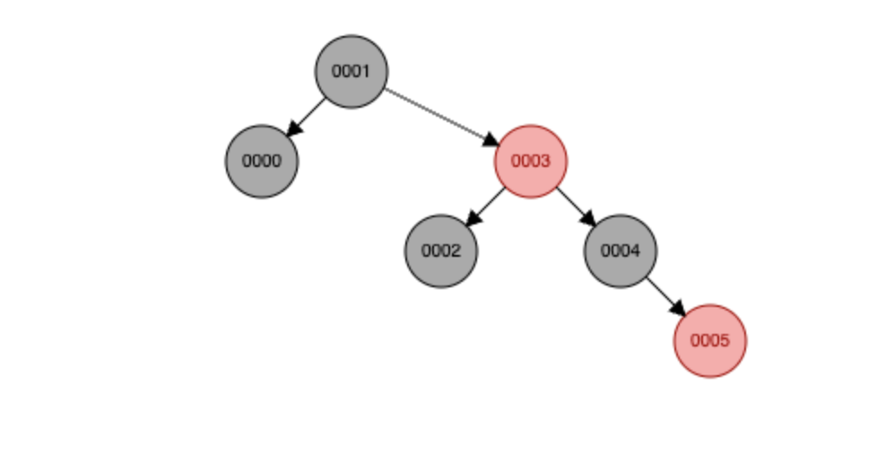
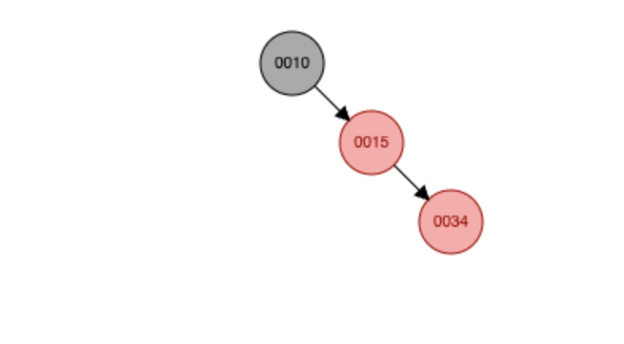
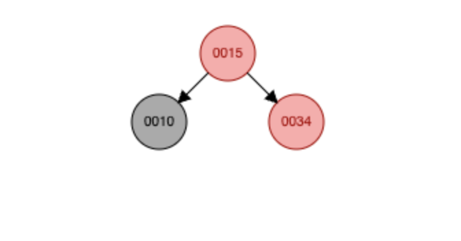
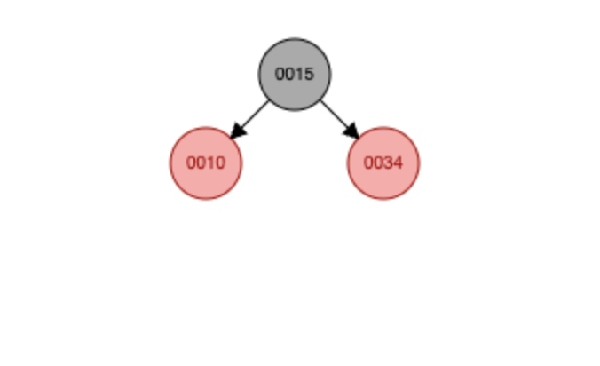

[](https://classroom.github.com/a/zBqi0PeJ)

# Red-Black Trees Research Paper

* Name: Tracy U
* Semester: Fall 2025
* Topic: Red-Black Trees


## Introduction

This report discusses the red black tree, which is a self-balancing binary search tree. This tree addresses the problem of a binary search tree becoming unbalanced.  A red black tree has the following properties: 

- The root node is always black and each node can be either black or red.
- Every leaf node of the red-black tree is black.
- The children of red nodes are black.
- The number of black nodes will be the same for every simple path from the root to the descendant leaf node.[^1]

Binary Search trees can be a more efficient data structure than linear data structures. However, in the worst case — when data is already sorted, for example — the tree can essentially become a linear structure. Self-balancing trees address this challenge using various approaches to ensure that a tree does not become unbalanced. 

The origin of the red black tree traces back to 1972, when Rudolf Bayer invented a data structure called a “symmetric binary B-tree”; it was later popularized as a “2-3” tree. These trees “all paths from root to leaf with the same number of nodes.” Later,  Leonidas J. Guibas and Robert Sedgewick built upon the symmetric binary B-tree to create the red black tree.[^2] 

Since then, red black trees have been used across programming languages— for example, TreeSet, TreeMap, and HashMap implementations in Java all utilize red black trees.[^3] 

## Analysis of Red-Black Trees

The space complexity of a red black tree is $O(n)$, like a Binary Search Tree. In addition to storing its data, each node also stores pointers to its parent and its left and right children. A red-black tree additionally requires its nodes to store their color (red or black). Because there are just two color options, tracking the color of each node only requires one additional bit of space.[^2] 

**Time Complexity:**

The time complexity of Search, Insert, and Delete is $O(\log n)$ as a result of the tree being balanced.[^2]

| **Function** | **Amortized**  | **Worst Case** |
| --- | --- | --- |
| **Search** | $O(\log n)$ | $O(\log n)$ |
| **Insert** | $O(\log n)$ | $O(\log n)$ |
| **Delete** | $O(\log n)$ | $O(\log n)$ |

The self-balancing nature of the tree ensures that the red black tree is efficient in even what would be the worst case scenarios for a binary search tree. 

## Empirical Analysis

Based on an analysis of time for insertion and search/find for $n$ elements, we can empirically observe  that these functions require only logarithmic growth. The following charts depict the time required for each function to complete for $n$ elements, up to 2.5 million elements. 

The times for one run have limited accuracy and may have been impacted by other computing demands at the time the script was running. That being said, while there are a few outliers — notably a dip around 1 million elements— the timings generally align with the expected type of growth based on the time complexity analysis for the function. 

**Table 1: Time required for function and n Elements in Seconds**

Table 1 shows the time required, in seconds, for Insert and find for $n$ elements for the first 20,000 and final 10,000 test runs. 

| **Number of Elements** | **Insert** | **Find** |
| :---: | :---: | :---: |
| 1,000 | 0.000255 | 0.000089 |
| 2,000 | 0.000538 | 0.000193 |
| 3,000 | 0.000874 | 0.000304 |
| 4,000 | 0.001191 | 0.000429 |
| 5,000 | 0.001511 | 0.000566 |
| 6,000 | 0.001862 | 0.000710 |
| 7,000 | 0.002223 | 0.000854 |
| 8,000 | 0.002588 | 0.001004 |
| 9,000 | 0.002966 | 0.001161 |
| 10,000 | 0.003334 | 0.001318 |
| 11,000 | 0.003707 | 0.001479 |
| 12,000 | 0.004097 | 0.001641 |
| 13,000 | 0.004540 | 0.001801 |
| 14,000 | 0.004905 | 0.001963 |
| 15,000 | 0.005470 | 0.002609 |
| 16,000 | 0.005695 | 0.002314 |
| 17,000 | 0.006040 | 0.002479 |
| 18,000 | 0.006487 | 0.002656 |
| 19,000 | 0.006847 | 0.002840 |
| 20,000 | 0.007257 | 0.003012 |
| … | … | … |
| 2,490,000 | 1.296656 | 0.808627 |
| 2,491,000 | 1.324592 | 0.798869 |
| 2,492,000 | 1.312680 | 0.807715 |
| 2,493,000 | 1.306611 | 0.814219 |
| 2,494,000 | 1.322617 | 0.801973 |
| 2,495,000 | 1.304994 | 0.812961 |
| 2,496,000 | 1.300590 | 0.812795 |
| 2,497,000 | 1.300697 | 0.818970 |
| 2,498,000 | 1.317295 | 0.822208 |
| 2,499,000 | 1.310516 | 0.803609 |
| 2,499,999 | 1.300193 | 0.821714 |

*Chart 1: Time to Find $n$ Elements in Red Black Tree* shows the growth in time to find $n$ elements in a red-black tree up to 2.5 million elements. The light blue line represents the time it took for each function to complete for $n$ elements from 0 to 2.5million in increments of 1,000, while the dark blue line is the trend line. The scale in this chart is logarithmic.



*Chart 2: Time to Insert $n$ Elements in Red Black Tree* depicts the growth in time to find $n$ elements in a red-black tree up to 2.5 million elements. The light orange line represents the time it took for each function to complete for $n$ elements from 0 to 2.5million in increments of 1,000, while the dark orange line is the trend line. The scale in this chart is logarithmic.

.png)

For reference, the following chart plots the same growth as plotted in Charts 1 and 2, with the addition of reference lines for the growth for $O(1)$, $O(n)$, $O(\log n)$, $O(n \log n)$, and $O(n^2)$. With scale, we can see truly how efficient the red black tree is. 



## Application

A binary search tree can lose its efficiency advantage if the data inserted into it is already sorted, or mostly sorted, or if it is adversarial - meaning the numbers are alternatingly slotted into left and right nodes. See visual examples below. In these worst-case scenarios for a binary search tree, the time complexity becomes much more like a linked list.


Worst case: Sorted[^4]


Worst case: Adversarial[^4]

A red black tree is one type of self-balancing tree that prevents these scenarios from occurring. Thanks to its self-balancing properties, a red black tree’s height is logarithmic. This maintains the tree’s efficiency. For example, inserting the sorted list into a red black tree would produce the following (see below). 


[^5]

Its efficient implementation has kept the red black tree in use across programming languages and use cases: 

- Red black trees are used in Java’s TreeMap, HashMap and TreeSet implementations
- Red black trees are used in managing some file and directory structures
- Red black trees are used for collision detection in graphics and game development.[^6]

## Implementation

The red black tree was implemented in C, using standard libraries. I based my code off code that was written in C++ and converted that to C with some slight modifications.

The key challenge I faced when implementing the code was understanding various conditions that were possible upon insertion and which actions they would require to fix violations of the red black tree properties.  It also mentally took some time to wrap my head around the idea of what rotation meant.[^6] 

To walk through an example, here is `rotateLeft` function. 

```c
/**
 * Rotates a node left
 * 
 * @param node the node to rotate left
 * @return the rotated node
*/
rbNode* rotateLeft(rbNode* node) {
    rbNode* x = node->right;
    rbNode* y = x->left;
    x->left = node;
    node->right = y;
    node->parent = x;
    if (y != NULL)
        y->parent = node;
    return x;
}
```

Here is a visual example[^5] of a left rotation with nodes valued at `10` and `15`, and inserting a node with the value of `34`. 



In Step 2, the node is rotated left, updating the left pointer for node `15` to `10` and the right pointer to `34`, while removing the right pointer for node `10`. 



In Step 3, the `10` node is repainted from black to red, and the `15` node is repainted from red to black. 



In terms of the rest of the implementation of the code, after the rotation and insertion, the code was relatively straightforward, following the patterns used in previous implementations of print, search, and traversing binary search trees. 

## Summary

The red black tree is a self-balancing binary search tree that maintains its efficiency through balancing operations that maintain a logarithmic height. This report demonstrates how red black trees achieve O(log n) time complexity for insert and find functions through implementation, performance testing, and empirical data collection. 

Through this project, I gained an understanding of self-balancing trees generally and some of the ways to overcome the worst-case scenarios of binary search trees. I also gained a greater sense of appreciation for the intricacy and complexity that goes into implementing data structures that can be used with ease in common programming languages.

### References:

[^1] GeeksforGeeks. 2025. Red-Black Tree definition & meaning in DSA. Retrieved December 7, 2025 from [https://www.geeksforgeeks.org/dsa/red-black-tree-definition-meaning-in-dsa/](https://www.geeksforgeeks.org/dsa/red-black-tree-definition-meaning-in-dsa/)

[^2] Wikipedia contributors. 2025. Red–black tree. Wikipedia, The Free Encyclopedia. Retrieved December 7, 2025 from [https://en.wikipedia.org/wiki/Red–black_tree](https://en.wikipedia.org/wiki/Red%E2%80%93black_tree)

[^3] Baeldung. Red-Black Trees Applications. Retrieved December 7, 2025 from [https://www.baeldung.com/cs/red-black-trees-applications](https://www.baeldung.com/cs/red-black-trees-applications)

[^4] David Galles. Data Structure Visualizations: Binary Search Tree. University of San Francisco. Retrieved December 7, 2025 from [https://www.cs.usfca.edu/~galles/visualization/BST.html](https://www.cs.usfca.edu/~galles/visualization/BST.html)

[^5] David Galles. Data Structure Visualizations: Red-Black Tree. University of San Francisco. Retrieved December 7, 2025 from [https://www.cs.usfca.edu/~galles/visualization/RedBlack.html](https://www.cs.usfca.edu/~galles/visualization/RedBlack.html)

[^6] GeeksforGeeks. 2025. Introduction to Red-Black Tree. Retrieved December 7, 2025 from [https://www.geeksforgeeks.org/dsa/introduction-to-red-black-tree/](https://www.geeksforgeeks.org/dsa/introduction-to-red-black-tree/)